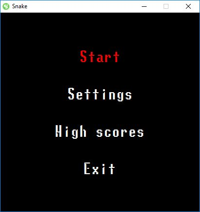
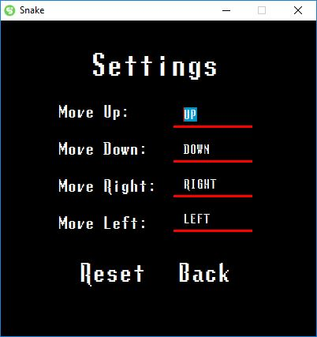
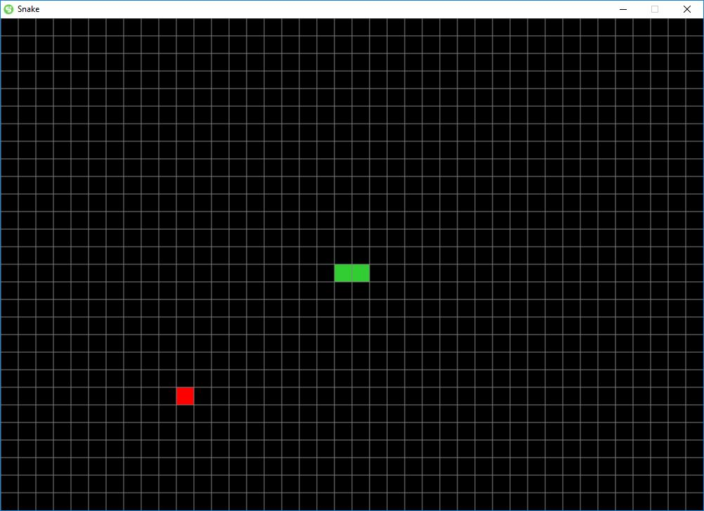
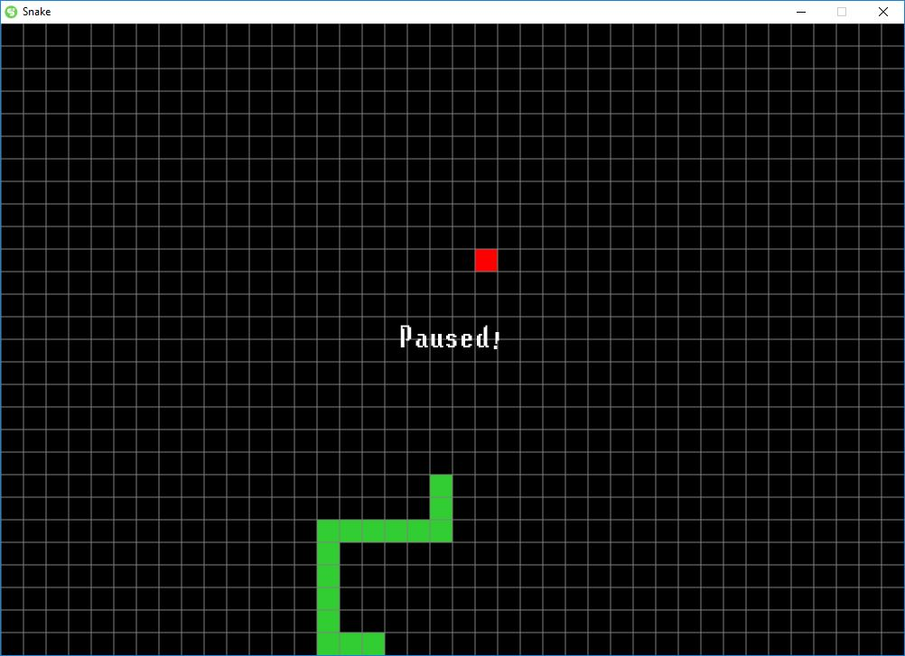
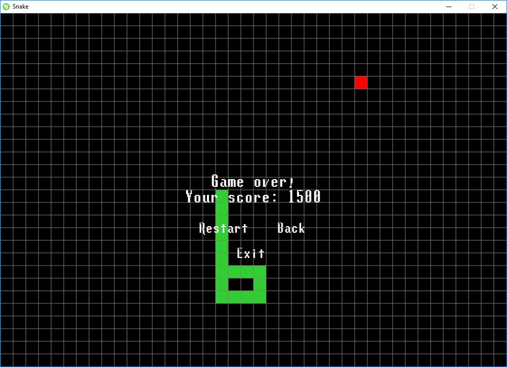

# Snake

## About
This is a two-dimensional game, where a sole player attempts to eat items by running into them with the head of the snake. Each item eaten makes the snake longer, so controlling is progressively more difficult.

## How to play
* If you don't have JRE (Java Runtime Environment) installed, then you have to do is first by downloading the correct installer from [here](https://www.oracle.com/technetwork/java/javase/downloads/jre8-downloads-2133155.html).  

If you are done with that, you can simply double click the .jar file to play the game, after you downloaded from [here](https://github.com/HbotondS/Snake/releases).
### Controls
The default controls are the **arrow keys**, but you can change the controls in the settings menu.

## Screenshots
### Menu

### Settings

### In game

### In game *(paused)*

### In game *(game over)*

## Disclaimer
I don't own [Lunchtime Doubly So Font](src/main/resources/font/lunchds.ttf).  
This font created by codeman38, you can find more fonts like this [here](http://www.zone38.net/).

## License
Licensed under the [MIT](LICENSE).
